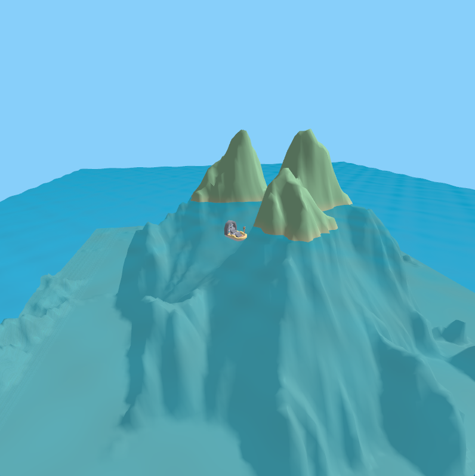
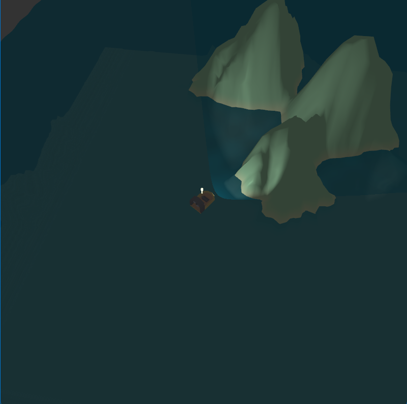
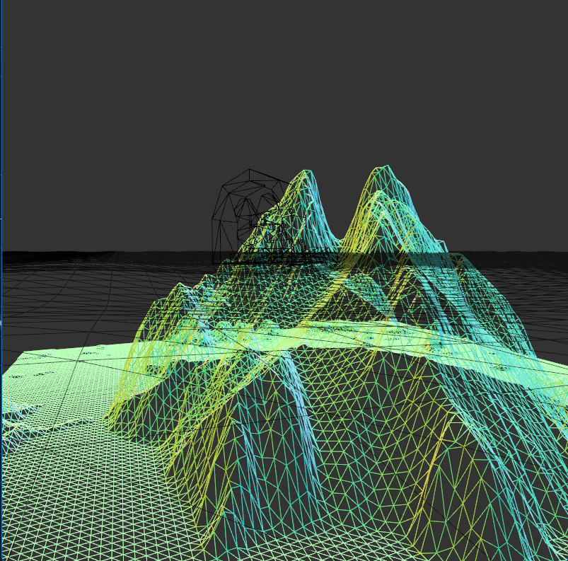
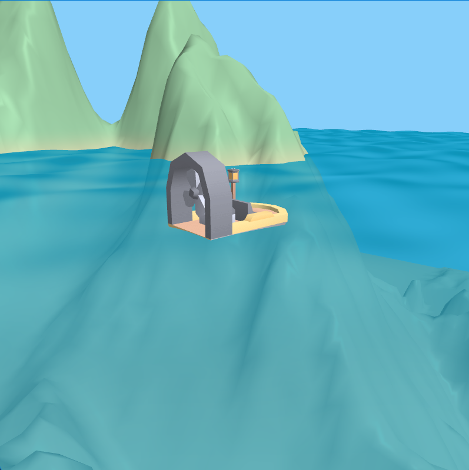
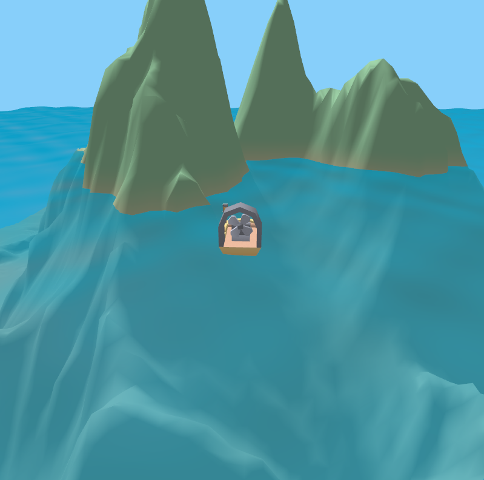
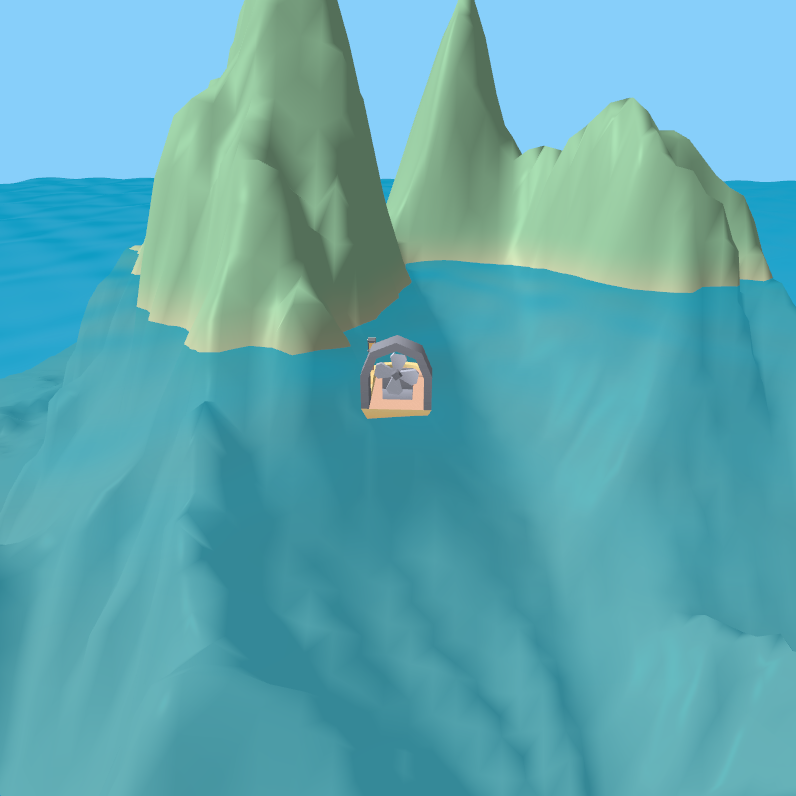
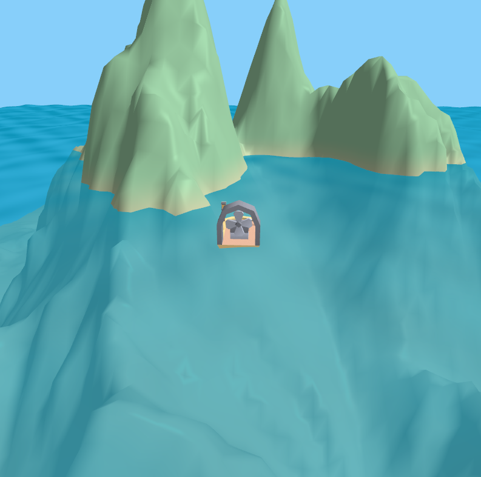
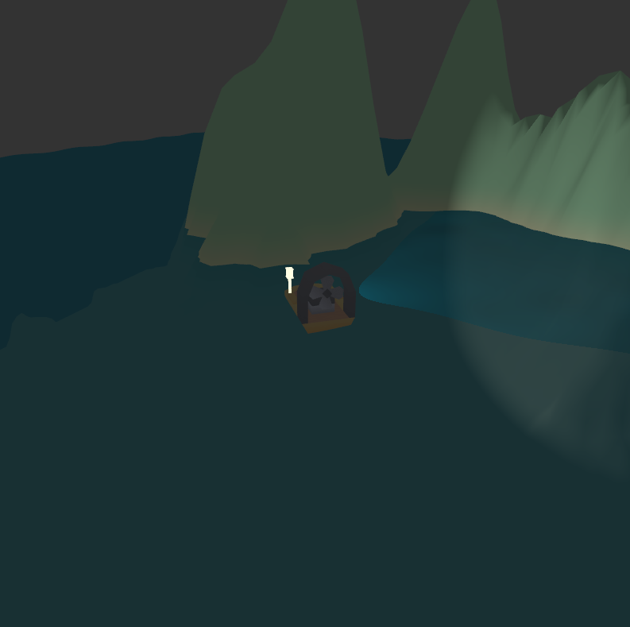
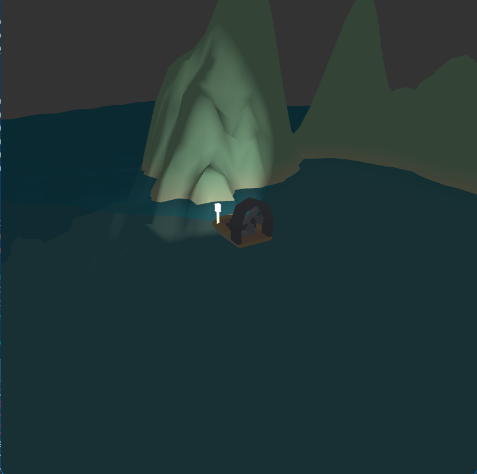

# COMP3170 Assignment 3 — 3D Island Scene (OpenGL / Java)

A 3D real-time rendered scene built with OpenGL (via LWJGL) in Java, submitted as **Assignment 3** for **COMP3170: Computer Graphics** (Session 1, 2025) at Macquarie University.

The scene features a hovercraft navigating around a procedurally-generated island terrain, complete with animated water, dynamic lighting, texturing, and a controllable third-person camera.

## Screenshots

| Day | Night |
|-----|-------|
|  |  |

| Wireframe | Water (close-up) |
|-----------|-----------------|
|  |  |

### Sunlight movement (`[` / `]`)

  

*Directional sunlight rotating from east to west, casting changing shadows across the terrain.*

### Torch / headlamp movement (`[` / `]`)

 

*Point spotlight mounted on the boat, rotating left and right in night mode with distance attenuation.*

---

## Features

| Feature | Description |
|---------|-------------|
| **Boat (Hovercraft)** | OBJ mesh with normals, UV texturing, spinning fan animation, WASD movement |
| **Height Map Terrain** | 100×100m island mesh generated from a PNG height map, with vertex normals and grass/sand texture blending |
| **Water** | Animated ripple normals, Fresnel-based transparency, specular lighting |
| **Lighting** | Day mode (directional sunlight) and night mode (point lamp on the boat) with ambient + diffuse + specular |
| **Debug Modes** | Wireframe (`B`), normals visualisation (`N`), UV visualisation (`M`), reset (`V`) |
| **Third-Person Camera** | Orbit (arrow keys), dolly (Page Up/Down), zoom FOV (`,`/`.`), aspect-ratio-aware |

## Controls

| Key | Action |
|-----|--------|
| `W` / `S` | Move boat forward / backward |
| `A` / `D` | Turn boat left / right |
| Arrow keys | Orbit camera around the boat |
| `Page Up` / `Page Down` | Dolly camera in / out |
| `,` / `.` | Zoom (FOV) in / out |
| `[` / `]` | Rotate sun (day) or lamp (night) |
| `M` | Toggle day / night mode |
| `B` | Toggle wireframe mode |
| `N` | Normals debug view |
| `V` | Return to normal view |

## Dependencies

This project relies on utility classes and framework code from the [COMP3170-lwjgl](https://github.com/comp3170/COMP3170-lwjgl) repository (provided as part of the course). That includes (but is not limited to):

- `Window` — LWJGL window management
- `IWindowListener` — window lifecycle callbacks
- `InputManager` — keyboard input handling
- `ShaderLibrary` / `TextureLibrary` — shader and texture loading/caching
- `OpenGLException` — OpenGL error handling

Make sure that project is on your classpath before running this one.

## Tech Stack

- **Java** with **LWJGL 3** (OpenGL bindings)
- **GLSL** vertex and fragment shaders
- **Wavefront OBJ** for the boat mesh
- **PNG** textures (terrain, boat) and height map
- 4× MSAA anti-aliasing, mipmaps with trilinear filtering, gamma correction (2.2)

## Topics Covered

- Triangular mesh construction (index buffers, vertex buffers)
- 3D transformations (TRS matrices, scene graph)
- Perspective & orthographic cameras
- Phong illumination (ambient, diffuse, specular)
- Texture mapping and multi-texture blending
- Procedural animation (ripple normals via sine waves)
- Fresnel transparency approximation

---

*Assignment specification and framework provided by the COMP3170 teaching team, Macquarie University.*
