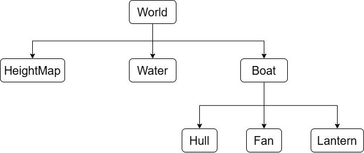
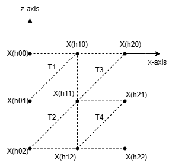
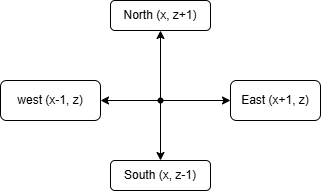

# COMP3170 Assignment 3 Report
### Student Name: Poojan Manojkumar Patel
## Your Development Environment
|Spec|Answer|
|----|-----|
|Java JDK version used for compilation|24|
|Java compiler compliance level used for compilation|24|
|Java JRE version used for execution|24|
|Eclipse version|2024-12 (4.34.0)|
|Your screen dimensions (width x height)|1920 x 1080|
|Your computer type (Mac/PC)|PC|
|Your computer make and model|Asus A15|
|Your computer Operating System and version|Windows 11|

## Features Attempted
Complete the table below indicating the features you have attempted. This will be used as a guide by your marker for what elements to look for, and dictate your <b>Completeness</b> mark.

| Feature | Weighting | Attempted Y/N |
|---------|-----------|---------------|
| General requirements | 3% | Y |
| Debug - Wireframe mode | 3% | Y |
| Debug - Normals mode | 3% | Y |
| Debug - UV mode | 3% | Y |
| Boat - Mesh | 3% | Y |
| Boat - Normals | 3% | Y |
| Boat - UVs & Textures | 4% | Y |
| Boat - Spinning Fan | 4% | Y |
| Boat - Movement | 4% | Y |
| Height Map - Mesh | 4% | Y |
| Height Map - Normals | 4% | Y |
| Height Map - UVs & Textures | 4% | Y |
| Height Map - Texture blending | 4% | Y |
| Water - Mesh & Normals | 2% | Y |
| Water - Transparency | 4% | Y |
| Water - Ripples | 4% | Y |
| Water - Fresnel effect* | 4% | Y |
| Lighting - Sun | 8% | Y |
| Lighting - Headlamp | 8% | Y |
| Cameras - Third-person | 4% | Y |
| **Total** | 80% | 80% |

# Documentation

Documentation is marked separately from implementation, but should reflect the approach taken in your code. You can attempt documentation questions for features you have not implemented or completed, but should clearly indicate that this is the case.

Documentation should include both diagrams and relevant equations to explain your solution. **Note**: Merely copying images from the lecture notes or other sources will get zero marks (and may be treated academic misconduct).

Where requested, meshes should be drawn to scale in model coordinates, including:
* The origin
* The X and Y axes
* The coordinates of each vertex
* The triangles that make the mesh

## Scene Graph (2%)



#### Lighting System:
* Day Mode: Directional sunlight affecting all objects
* Night Mode: Point spotlight from lantern
* Ambient light in both modes
#### Transform Hierarchy:
* HeightMap and Water are independent at root level
* Boat's components are hierarchically linked:
    * Fan inherits boat position + local rotation
    * Lantern position is relative to boat for spotlight calculations
    * Camera position is computed relative to boat position

## Height Map (6%)

### HeightMap 3x3 Mesh:

```
X = Vertex point
T = Triangle
h = Height value from heightmap
```


#### Implementation:

```
// Vertex Generation (scaled to 100x100m terrain)
float xScale = 100f / (width - 1);  // Scale X coordinates
float zScale = 100f / (depth - 1);  // Scale Z coordinates
float yScale = 50f;                 // Maximum height of 50m

// Vertex positions for 3x3 grid
for (int z = 0; z < 3; z++) {
    for (int x = 0; x < 3; x++) {
        float y = heights[x][z] * yScale;
        vertices.add(new Vector3f(x * xScale, y, z * zScale));
        uvs.add(new Vector2f(x / 2.0f, z / 2.0f));
    }
}

// Index buffer for triangles
int[] indices = {
    0, 3, 1,  // T1
    1, 3, 4,  // T2
    1, 4, 2,  // T3
    2, 4, 5,  // T4
    3, 6, 4,  // T5
    4, 6, 7,  // T6
    4, 7, 5,  // T7
    5, 7, 8   // T8
};
```

### Normal Calculation

For each vertex P(x,y,z), we calculate the normal using central differences:



#### Formula:

Given a vertex P at position (x,z):
```
    //Get surrounding heights
   yN = height(x, z+1) * yScale    // North
   yS = height(x, z-1) * yScale    // South
   yE = height(x+1, z) * yScale    // East
   yW = height(x-1, z) * yScale    // West

   //Calculate slopes using central differences
   dx = (yE - yW) / (2 * xScale)
   dz = (yN - yS) / (2 * zScale)

   //Normal vector
   N = normalize(-dx, 1.0, -dz)
```

#### Implementation:

```
private Vector3f computeNormal(int x, int z, float xScale, float zScale, float yScale) {
    // Get heights of neighboring vertices
    float yN = getHeight(x, z + 1) * yScale;
    float yS = getHeight(x, z - 1) * yScale;
    float yE = getHeight(x + 1, z) * yScale;
    float yW = getHeight(x - 1, z) * yScale;
    
    // Calculate gradients
    float dx = (yE - yW) / (2.0f * xScale);
    float dz = (yN - yS) / (2.0f * zScale);
    
    // Create and normalize the normal vector
    return new Vector3f(-dx, 1.0f, -dz).normalize();
}
```
The resulting normal vectors provide smooth shading across the terrain surface and accurate lighting calculations. The negation of dx and dz ensures the normal points in the correct direction for OpenGL's coordinate system.

## Water - Ripples (3%)

#### Wave Function:
The ripple effect is created by combining two wave patterns:
```
// Wave components
float wave1 = sin(v_uv.x * rippleFreq + u_time * rippleSpeed) *
              cos(v_uv.y * rippleFreq + u_time * rippleSpeed);

float wave2 = sin(v_uv.x * rippleFreq * 1.5 - u_time * rippleSpeed * 0.8) *
              cos(v_uv.y * rippleFreq * 1.5 - u_time * rippleSpeed * 0.8);

// Combined wave
float wave = (wave1 + wave2) * 0.5;
```

#### Formula:
The normal modification is calculated using:

Constants:
- rippleFreq = 8.0  (wave frequency)
- rippleSpeed = 2.0 (animation speed)
- rippleAmp = 0.15  (wave height)

1. Wave Calculation:
   - W(u,v,t) = 0.5 * (W₁ + W₂)
   - where:
   - W₁ = sin(u·f + t·s) * cos(v·f + t·s)
   - W₂ = sin(u·1.5f - t·0.8s) * cos(v·1.5f - t·0.8s)
   
   f = rippleFreq   
   s = rippleSpeed  
   t = time

2. Normal Modification:
   - N' = normalize(N₀ + (wave * rippleAmp, 0, wave * rippleAmp))

#### Implementation:

```
// Create ripple normal
vec3 rippleNormal = normalize(v_normal + vec3(wave * rippleAmp, 0.0, wave * rippleAmp));

// View direction for lighting calculations
vec3 viewDir = normalize(u_cameraPos - v_worldPos);

// Lighting calculation using modified normal
float sunDiffuse = max(dot(lightDir, rippleNormal), 0.0);

// Specular reflection with Fresnel effect
vec3 reflectDir = reflect(-lightDir, rippleNormal);
float spec = pow(max(dot(viewDir, reflectDir), 0.0), 64.0);
float fresnelTerm = pow(1.0 - max(dot(viewDir, rippleNormal), 0.0), 4.0);
float specular = spec * fresnelTerm * 0.8;
```

### Effects on Lighting

The modified normal affects several aspects of the water rendering:

1. Diffuse Reflection: Changes based on ripple normal orientation
2. Specular Highlights: Creates dynamic sparkles on water surface
3. Fresnel Effect: Varies water transparency with viewing angle
4. Dynamic Animation: Ripples move across surface over time

The combination of these effects creates a realistic water appearance with:
* Moving ripples
* Dynamic reflections
* View-dependent transparency
* Animated surface detail

## Lighting (6%)

### Day-time Lighting

#### Formula:
Given:
- P: Surface point (v_worldPos)
- N: Surface normal
- L: Normalized sun direction (u_sunDir)
- V: View direction (normalize(u_cameraPos - P))

1. Diffuse Light:   
   diffuse = max(dot(N, L), 0.0)

2. Specular Reflection: 
   R = reflect(-L, N)   
   spec = pow(max(dot(V, R), 0.0), 64.0)

3. Final Color:     
   color = baseColor * (diffuse + u_ambient) + specularColor * spec

#### Implementation:

```
if (u_day == 1) {
    vec3 lightDir = normalize(u_sunDir);
    
    // Diffuse reflection
    float diffuse = max(dot(normal, lightDir), 0.0);
    
    // Specular reflection
    vec3 reflectDir = reflect(-lightDir, normal);
    float spec = pow(max(dot(viewDir, reflectDir), 0.0), 64.0);
    
    // Combine lighting
    vec3 finalColor = baseColor * (diffuse + u_ambient) + 
                     vec3(spec) * specularStrength;
}
```

### Night-time Lighting:

#### Formula:

Given:
- P: Surface point (v_worldPos)
- N: Surface normal
- L: Lamp position (u_lampPos)
- D: Lamp direction (u_lampDir)

1. Light Vector:    
   toLight = normalize(L - P)   
   distance = length(L - P)

2. Spotlight Cone:      
   spotEffect = dot(toLight, normalize(-D))     
   intensity = (spotEffect > 0.7) ? 1.0 : 0.0

3. Attenuation:     
   att = 1.0 / (1.0 + 0.1 * distance + 0.01 * distance²)

4. Final Light:     
   diffuse = max(dot(N, toLight), 0.0) * intensity * att    
   color = baseColor * (diffuse + u_ambient)

#### Implementation:

```
else {  // Night mode
    vec3 toFrag = normalize(v_worldPos - u_lampPos);
    float spotlight = dot(u_lampDir, toFrag);
    
    if (spotlight > 0.7) {  // Inside spotlight cone
        float distance = length(u_lampPos - v_worldPos);
        float attenuation = 1.0 / (1.0 + 0.1 * distance + 
                                  0.01 * distance * distance);
        
        float diffuse = max(dot(normal, -toFrag), 0.0) * 
                       0.3 * attenuation;
        
        vec3 reflectDir = reflect(toFrag, normal);
        float spec = pow(max(dot(viewDir, reflectDir), 0.0), 32.0);
        float specular = spec * 0.4 * attenuation;
        
        finalColor = baseColor * (diffuse + u_ambient) + 
                    vec3(specular);
    }
}
```

Key Differences:
- Day lighting uses directional light (parallel rays)
- Night lighting uses point light with distance attenuation
- Night lighting includes spotlight cone effect
- Ambient light levels differ between day and night

## Camera (3%)

#### Formula:

Given:
- B: Boat position
- d: Camera distance (adjustable with Page Up/Down)
- θ: Pitch angle (up/down, clamped to ±90°)
- φ: Yaw angle (left/right rotation)
- fov: Field of view (adjustable with ,/.)

Camera Position Calculation:    
1. Offset from boat:    
   x = d * cos(θ) * sin(φ)      
   y = d * sin(θ)       
   z = d * cos(θ) * cos(φ)      

2. Final camera position:   
   cameraPos = boatPos + offset

3. View Matrix:     
   lookAt(cameraPos, boatPos, upVector)

4. Projection Matrix:   
   perspective(fov, aspect, nearPlane, farPlane)

#### Implementation:

```
public class Camera {
    private float distance = 10.0f;  // Initial distance
    private float pitch = 0.0f;      // Up/down angle
    private float yaw = 0.0f;        // Left/right angle
    private float fov = 60.0f;       // Field of view
    
    public void updateCamera(Vector3f boatPosition, float deltaTime) {
        // Update angles based on input
        if (input.isKeyDown(GLFW_KEY_LEFT)) 
            yaw += ROTATION_SPEED * deltaTime;
        if (input.isKeyDown(GLFW_KEY_RIGHT))
            yaw -= ROTATION_SPEED * deltaTime;
            
        // Clamp pitch to prevent camera flipping
        if (input.isKeyDown(GLFW_KEY_UP))
            pitch = Math.min(pitch + ROTATION_SPEED * deltaTime, 
                           (float)Math.PI/2 - 0.1f);
        if (input.isKeyDown(GLFW_KEY_DOWN))
            pitch = Math.max(pitch - ROTATION_SPEED * deltaTime, 
                           -(float)Math.PI/2 + 0.1f);
            
        // Adjust distance (dolly)
        if (input.isKeyDown(GLFW_KEY_PAGE_UP))
            distance = Math.max(5.0f, distance - DOLLY_SPEED * deltaTime);
        if (input.isKeyDown(GLFW_KEY_PAGE_DOWN))
            distance = Math.min(30.0f, distance + DOLLY_SPEED * deltaTime);
            
        // Adjust FOV (zoom)
        if (input.isKeyDown(GLFW_KEY_COMMA))
            fov = Math.max(30.0f, fov - ZOOM_SPEED * deltaTime);
        if (input.isKeyDown(GLFW_KEY_PERIOD))
            fov = Math.min(90.0f, fov + ZOOM_SPEED * deltaTime);
            
        // Calculate camera position
        float x = distance * (float)Math.cos(pitch) * (float)Math.sin(yaw);
        float y = distance * (float)Math.sin(pitch);
        float z = distance * (float)Math.cos(pitch) * (float)Math.cos(yaw);
        
        Vector3f cameraPos = new Vector3f(
            boatPosition.x + x,
            boatPosition.y + y,
            boatPosition.z + z
        );
        
        // Update view matrix
        viewMatrix.setLookAt(
            cameraPos,           // Camera position
            boatPosition,        // Look at boat
            new Vector3f(0,1,0)  // Up vector
        );
        
        // Update projection matrix
        float aspect = (float)windowWidth / windowHeight;
        projectionMatrix.setPerspective(
            (float)Math.toRadians(fov),  // FOV in radians
            aspect,                       // Aspect ratio
            0.1f,                        // Near plane
            1000.0f                      // Far plane
        );
    }
}
```

#### Key Features:
**Camera Movement:**

* Orbits around boat at fixed distance
* Maintains constant up vector (0,1,0)
* Smoothly follows boat position

**Constraints:**

* Pitch clamped to ±89.9° to prevent gimbal lock
* Distance limited between 5m and 30m
* FOV restricted to 30°-90° range

## Controls:

### Camera Controls:

**Arrow Keys:**
 - UP: pitch camera up
 - DOWN: pitch camera down
 - LEFT: Rotate Camera left(yaw)
 - RIGHT: Rotate Camera Right(yaw)

 **View Adjustment:**
 - PAGE UP: Move camera closer to boat
 - PAGE DOWN: Move camera farther from the boat
 - ,(comma): zoom in
 - .(period): zoom out

### Boat Controls:

 **movement:**
 - W: Move forward
 - S: Move backward
 - A: Turn Left
 - D: Turn Right

### Debug Mode:

**Visualization:**
 - B: Toggle wireframe mode (shows mesh structure)
 - N: Toggle normal visualization mode
 - M: Toggle UV visualization mode
 - V: Return to normal rendering mode

### Lighting Controls:

**Time & Lighting:**
 - M:  Toggle between day/night modes
 - [: Rotate sun/lamp left
 - ]: Rotate sun/lamp right

**Day Mode:**
 - Sun rotates east to west

**Night Mode:**
 - Lantern provides spotlight illumination
